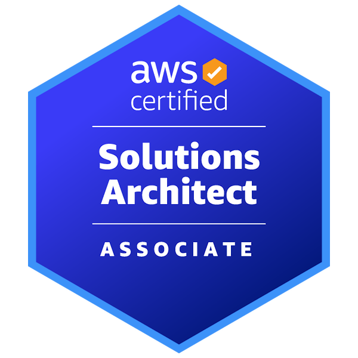

# **Guilherme Alves Peres**

  Com experiência em empresas de destaque de diversos setores, adquiri habilidades em lidar com complexidade, otimização de custos e liderança.
   
  Tenho paixão por programação, computação em nuvem, segurança e sistemas Linux, sempre me atualizando para acompanhar as últimas tendências do mercado.

  📧 <a href="mailto:contact@gperes.dev">contact@gperes.dev</a>
     
  📞 <a href="tel:+5511939367874">+55 11 93936-7874</a>
     
    📍 Campos Elíseos - São Paulo/SP
     
    🔗 <a href="https://allmylinks.com/guialvesp1">Links Úteis (GitHub; LinkedIn; etc)</a>

---

## 🎯 **Objetivo**

Minha missão consiste em assegurar que as aplicações sejam altamente disponíveis, resilientes e seguras. Sou um entusiasta de soluções arquiteturais e trabalho em equipe, sempre buscando construir arquiteturas e cargas de trabalho complexas quando necessário, porém simplificando-as sempre que possível.
<!--
Preencher de acordo com a vaga que vai enviar

(A empresa, precisa acreditar que você a conhece e está interessado em fazer parte, então personalize o máximo de acordo com a divulgação da vaga e característica da empresa.
Além do objetivo claro, você pode descrever lá nas informações adicionais suas habilidades de acordo com a missão, visão e valores da empresa)
-->

## 🎓 **Formação Acadêmica**

* Engenharia de Software @ **Universidade Cruzeiro do Sul (UNICSUL)**\
  2019 - 2023
* Defesa Cibernética @ **Faculdade de Informática e Administração Paulista (FIAP)**\
  2020 - 2021

## 👨‍💻 **Experiência Profissional**

* DevOps Engineer @ **Hospital Albert Einstein**, Remoto\
  Out/2022 -

* DevOps Engineer @ **Base dos Dados**, Remoto\
  Abr/2022 -

* Analista de Tecnologia da Informação @ **ALZ Grãos**, Palmas/TO\
  Jun/2019 - Fev/2021

  Responsável por viabilizar a tecnologia de acordo com os interesses do negócio e diretoria, propondo a aproximação dos times para entregar o melhor resultado considerando as necessidades de cada área.

  Captando novos fornecedores de tecnologia para criar soluções criativas nas áreas de atendimento ao cliente (FreshDesk), autenticidade, confiabilidade e integridade dos documentos (BRy Tecnologia), RH (Velti), automação rodoviária (Toledo), conferência empresarial (Logitech), programas de apoio administrativo (Office 365), outsourcing (Tecnoset).

  Gestão de projetos de infraestrutura física e lógica para suprir as necessidades da matriz e mais 15 filiais.

  Gerênciamento do parque tecnológico através de padronização de acordo com necessidade da área/projeto. Virtualização utilizando VMware vSphere. IPS/IDS e comunicação entre as filiais com soluções SonicWall. Estrutura local de rede wireless com balanceamento de carga (Ubiquiti EdgeMax/Unifi UAP).

  Participando das definições de ações e prazos de defesa cibernética (ações com origem interna, de auditoria ou de LGPD), atualização de documentação, efetuando apresentação de diversos assuntos de defesa cibernética em integrações para novos funcionários (conscientização);

  Implantação de metodologias ágeis Scrum, com prazo de entrega para as demandas dentro da Sprint, gerenciando através da ferramenta Azure DevOps.

* Analista de Desenvolvimento de Sistemas @ **Photon Group**, São Paulo/SP; Palmas/TO\
  Jun/2015 - Fev/2018

  Responsável pela implantação da tecnologia VoIP utilizando software Open Source Asterisk (FreePBX/Elastix), captando e validando os fornecedores SIP. Para atender +30 posições administrativas e +40 posições da operação de telemarketing.

  Desenvolvimento de módulos específicos para a integração com as demais ferramentas do negócio (AWS, HubSpot e LightHouse), utilizando a linguagem Python.

  Gerenciamento do ambiente Cloud com Amazon Web Service nos serviços EC2 (Linux), S3, EFS, RDS (MySQL/PostgreSQL), Route53, VPC e IAM.

  Estrutura local de rede wireless com balanceamento de carga (Ubiquiti EdgeMax/Unifi UAP)

* Analista de Redes e de Comunicação de Dados @ **NXS Tecnologia e Serviços**, São Paulo/SP\
  Mai/2013 - Jun/2015

  Atuação estratégica no setor de Tecnologia da Informação, com foco em projetos de telecomunicação (Interactive Intelligence e Asterisk). Participando da análise e implantação de novos projetos, buscando corrigir problemas existentes no ambiente ou melhorar o desempenho dos sistemas através do melhor custo-benefício pré-estabelecido, proporcionando aos clientes externos a melhor experiência possível.

  Instalação física de recursos em ambientes de alta disponibilidade (UOL Diveo). Suporte a soluções CheckPoint, fornecendo manutenção e correção de bugs, upgrades de SO, hotfixes, recomendações para melhorar desempenho, efetuar monitoramento, mantendo o padrão de segurança, usando as melhores práticas de acordo com a CheckPoint.

* Estagiário de Tecnologia da Informação @ **Hoje BPO Contact Center**, São Paulo/SP\
  Dez/2012 - Abr/2013

  Suporte técnico aos usuários buscando solucionar problemas em geral de todos os componentes da rede corporativa da empresa como: servidores, estações de trabalho, impressora e circuítos de telecomunicações.

## ®️ **Certificações**

## 🧠 **Conhecimentos**

## ℹ️ **Informações Adicionais**

***Faculdade de Informática e Administração Paulista:*** Membro do grupo consagrado entre os três melhores da turma, por três semestres dentre os quatro cursados.

***ALZ Grãos:*** Responsável principal por todo o projeto técnico de infraestrutura de tecnologia (alta disponibilidade) do maior armazém do grupo (Unidade de Porto Nacional/TO).

***Photon Group:*** Responsável pelo projeto de implantação de telefonia VoIP (baseado em Asterisk), onde proporcionou uma economia de mais de meio milhão ao ano para a empresa comparado com a solução anterior (Interactive Intelligence).
